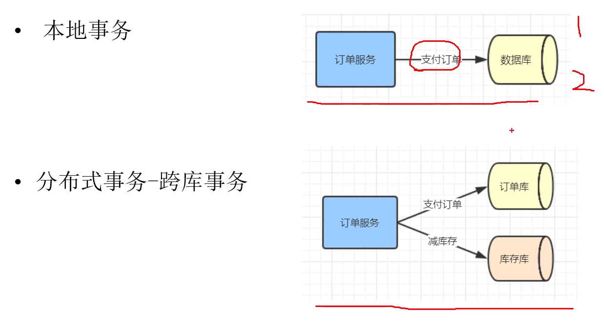
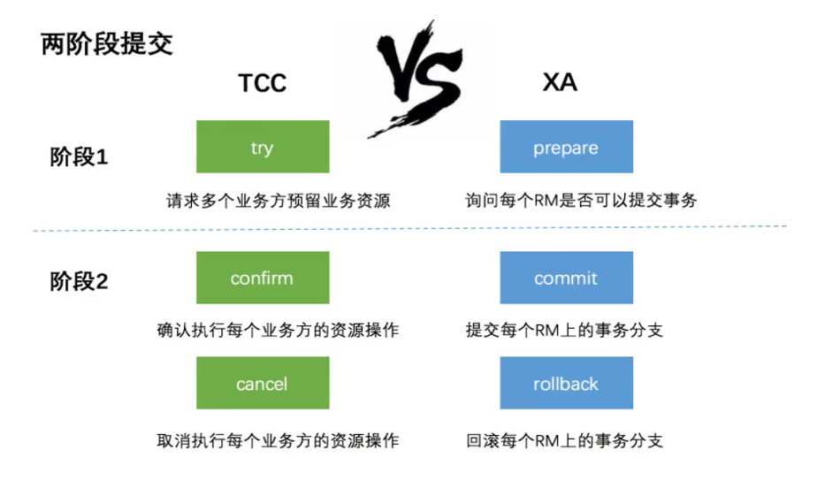
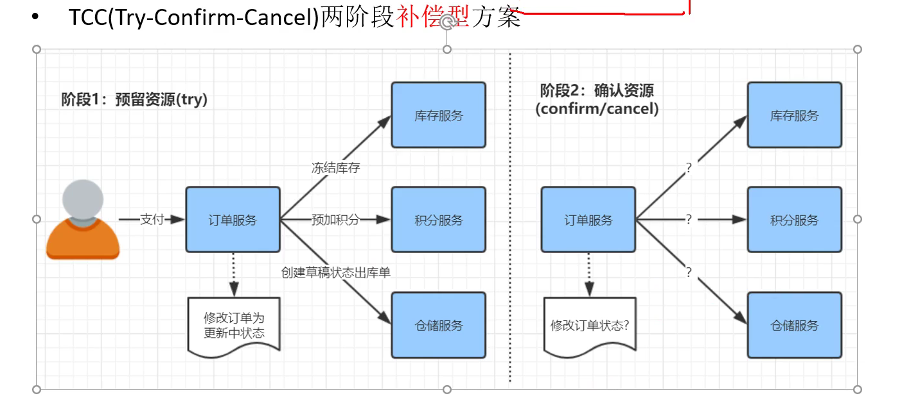

# 事务：
 1. 本地单库事务  -- @transactional
 2. 跨库分布式事务(比如数据量大了以后分库)
 3. 微服务分布式事务
   

如何解决分布式事务？  
分布式事务不能百分百解决，只可能尽量提高成功概率


#XA/JTA规范式
## 两阶段提交协议（2PC）   -- 适用于跨库
   

 第一阶段：预提交  
 预先锁定资源，预先校验数据库，缓存中间件服务是否正常
 
 第二阶段：commit/rollback  
 提交或回滚
 
 

 
## TCC （try-confirm-cancel） 两阶段补偿型方案  --试用于跨微服务
   
每个接口需要实现3个API，try的API， commit  rollback 的API

 一阶段中如果有服务失败，二阶段执行回滚。
 如果第二阶段提交或者回滚失败，
 要么系统挂了，否则大概率是网络问题，失败记录日志，定时重试，如果很多次仍然不成功，就告警通知人工介入。

自己实现TCC很复杂，有相关的开源框架：
Atomikos, tcc-transaction  bytetcc   支付宝GTS

TCC 与XA/JTA对比
- XA 是资源层面的分布式事务，强一致性，在两阶段提交的过程中，一直会持有资源的锁
- TCC是业务层面的分布式事务，最终一致性，不会一直持有资源的锁

分布式事务案例
```java
```
