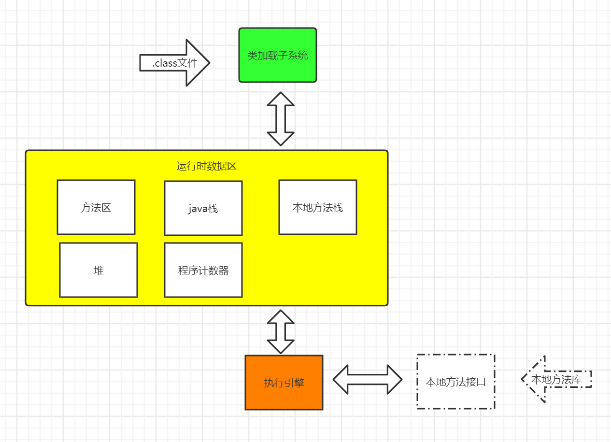
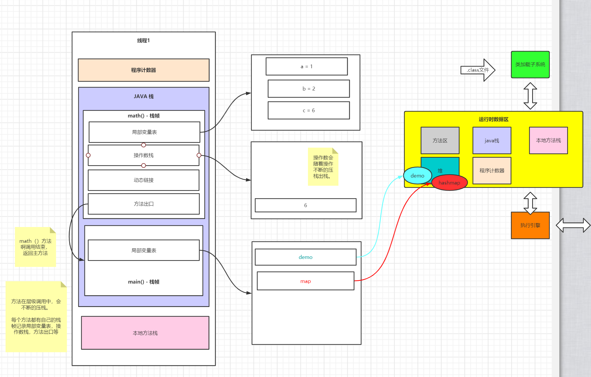
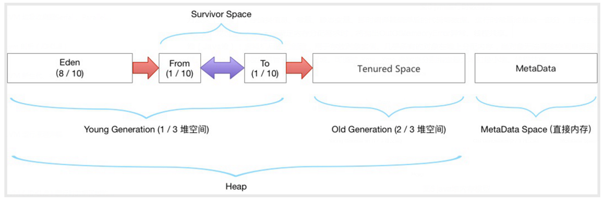

## 一、JVM 调优目的  
  STW ( stop the world)  JVM FULL GC时会停止掉所有其他用户线程，只做垃圾收集。  
  full Gc 次数越少越好，每次Full Gc 时间越短越好。
  
  了解JVM底层结构及原理，才能实现对JVM的优化

## 二、JVM整体结构
jvm 主要由三大部分组成：
- 类加载子系统
- 运行时数据区  
  程序计数器  堆  栈  方法区
- 执行引擎
主要结构图如下：
 


每个线程都有自己的程序计数器，java栈，本地方法栈。
## JvmDemo
```java
package com.hujie.javalearn.jvm.demo;

public class JvmDemo {
    private static  final  Integer CONSTANT_1 = 55;

    private int math() {
        int a  =1;
        int b =2;
        int c = (a+b) * 2;
        return c;
    }

    public static void main(String[] args) {
        JvmDemo demo = new JvmDemo();
        // 动态链接demo
        // Map<String, String> map = new HashMap();
        // map.put("key", "value");
  
        // Thread t = new Thread();
        // t.start();
        System.out.println(demo.math());
    }

}

```
该demo对应的数据存储示例如下。局部变量等存放在JAVA方法栈，对象存在堆中，方法栈中的引用指向堆中的对象。
 
动态链接是指接口类的引用，调用某个方法时（比如上面的put()方法时，能动态的找到对应的实现类，并调用其相应方法）  

可以通过javap -c JvmDemo.class 对字节码进行反编译查看。
```class
// Compiled from "JvmDemo.java"
public class com.hujie.javalearn.jvm.demo.JvmDemo {
  public com.hujie.javalearn.jvm.demo.JvmDemo();
    Code:
       0: aload_0
       1: invokespecial #1                  // Method java/lang/Object."<init>":()V
       4: return

  public static void main(java.lang.String[]);
    Code:
       0: new           #2                  // class com/hujie/javalearn/jvm/demo/JvmDemo
       3: dup
       4: invokespecial #3                  // Method "<init>":()V
       7: astore_1
       8: getstatic     #4                  // Field java/lang/System.out:Ljava/io/PrintStream;
      11: aload_1
      12: invokevirtual #5                  // Method math:()I
      15: invokevirtual #6                  // Method java/io/PrintStream.println:(I)V
      18: return

  static {};
    Code:
       0: bipush        55
       2: invokestatic  #7                  // Method java/lang/Integer.valueOf:(I)Ljava/lang/Integer;
       5: putstatic     #8                  // Field CONSTANT_1:Ljava/lang/Integer;
       8: return
}
```


## 2.2 JVM运行时数据区
- java 栈  
   一个线程对应一个栈  
   每个方法在执行的同时都会创建一个栈帧  
   用于存储局部变量表，操作数栈，动态链接，方法出口等信息  
   不存在垃圾回收问题。线程结束栈就释放  
   线程请求的栈深度大于虚拟机栈所允许的深度，将抛出StackOverFlowError异常, 可通过 -Xss指定栈空间大小

- native 本地方法栈（线程私有） 

  （当调用到本地方法时会涉及，比如Thread.start()  内部就由一个native的start0方法） 
  执行引擎遇到native方法时，就会调用本地方法库。

- 程序计数器（线程私有）  
 一个指针，用来存储下一条指令的地址。比如方法返回时要返回到的主方法的地址。
 
- 方法区（线程共享）  
   所有定义方法的信息保存在该区域  
   比如静态变量、常量、类信息（构造方法/接口定义）、运行时常量池等。

- 堆（线程共享）
 存放对象实例  
 当申请不到足够空间时会触发outOfMemoryException， 可通过-Xmx -Xms指定最大堆和最小堆.  
 是垃圾回收的主要区域。
   
  
  新生代老年代 1： 2  
  eden   from  to  8 : 1 ：1  
  元数据区： 元数据区取代了永久代(jdk1.8以前)，区别在于元数据区并不在虚拟机中，而是使用本地物理内存。  
            
            
            和永久代类似，都是对JVM规范中方法区的实现。
            
            元数据区的动态扩展。 默认-XX:Metaspacesize值为21MB的高水位线。一旦触及则Full GC将被触发并卸载没有用的类。  
            然后高水位线将会重置。新的高水位线的值取决于GC后释放的元空间。  
            如果释放的空间少，这个高水位线则上升。如果释放空间过多，则高水位线下降。
            
            为什么jdk1.8 方法区取代了永久代？  
            移除永久代是为融合HotSpot JVM与 JRockit VM而做出的努力，因为JRockit没有永久代，不需要配置永久代
            
 
  
- 栈，堆，方法区的交互关系  
  Dog d =new Dog();
  d 是存在于栈中的引用， Dog类的对象类型数据（类基本信息）存在方法区， 具体对象实例数据在Java堆中。

## JVM 2.3 执行引擎  
  编译型： 统一编译，后续直接执行，第一次执行慢。
  解释型： 翻译一行执行一行，速度慢
 
 JVM 是mixed 模式，java -v 命令输出可以看到。


## JVM类加载器


## JVM内存结构


## JVM执行引擎
