[一、索引原理](#chapter1)  
[二、索引优化](#chapter2)  
# <span id="chapter1">一、索引原理</span>
帮助Mysql高效获取数据的排好序的数据结构([数据结构教学网站](https://www.cs.usfca.edu/~galles/visualization/Algorithms.html))   
存储在文件里  
索引结构（二叉树，红黑树，Hash, **_Btree_**）

为什么用Btree作为索引，而不是二叉树，红黑树等 ？ 
- 二叉树作为索引
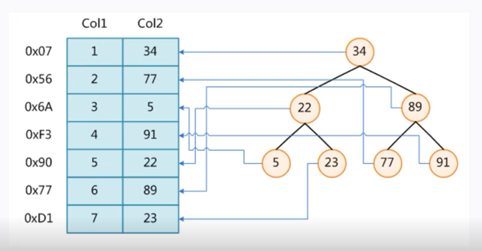
  &emsp;但是当数据升序或者降序时，二叉树就退化成了链表,树深度高 
- 红黑树  
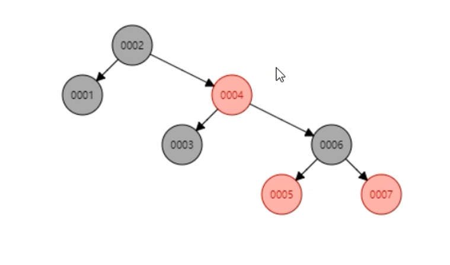   
  &emsp;红黑树是一个二叉平衡树，自动平衡功能相对二叉树单边增长的情况会更好  
  &emsp;但是红黑树是一种二叉树，当数据量大的时候，树的深度很高，当要查的数据在叶子节点时，会需要很多次磁盘IO操作,查找速度不够快
- Hash  
  &emsp;查询速率快  
  &emsp;等值查询快，但是范围查询：例如>6
  
- Btree  
   
  &emsp; 通过增加树的度数，横向扩展，降低树的高度。几百万的数据甚至可以控制到3-5层。  
  叶节点具有相同的深度  
  叶节点的指针为空  
  叶节点的数据从左向右自增  
  
   &emsp;通过几次找到节点，整个节点数据载入内存，再在内存中进行随机访问找到数据。速度非常快。  
  
   &emsp;是不是度数越大，让树的深度为1的时候最好呢？？
  
- B+Tree  


Mysql中建索引时，可以选择索引类型是Hash或者Btree(一般Hash使用较少)
磁盘数据存储以页为单位，磁盘与内存的交互也是以页为单位。  
-》 B+Tree的节点大小不能过大，需要最好能一次IO就读入内存
-》因此B+Tree的度不能无限的大
mysql 一般会把一个索引节点的大小设置为1页，例如16K

当非叶子节点只存索引，不存数据时，在每个索引节点大小限定（例如1页）的情况下，每个小索引节点占用的大小越小，小索引节点
的数量更多，树的度也就更多，树高度更小，查询时IO次数更少。

叶子节点作为最后一层节点，存储数据不影响IO次数。（叶子层节点中还有从左向右的指针）  
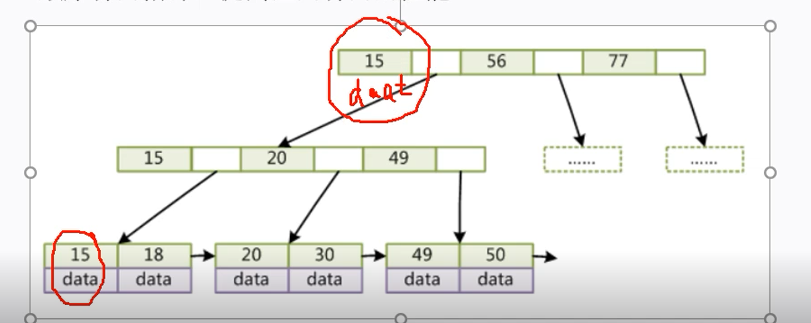   
非叶子节点的索引做了冗余（如图中15），非叶子节点的数据移到了叶子节点  

B+ tree的度一般会超过100，高度3-5.  

# 二、基于原理分析存储引擎  
说明：存储引擎是在表级别的（建表时可以指定），不是数据库级别
### MYISAM 索引实现
底层数据与索引分开存储（非聚集）
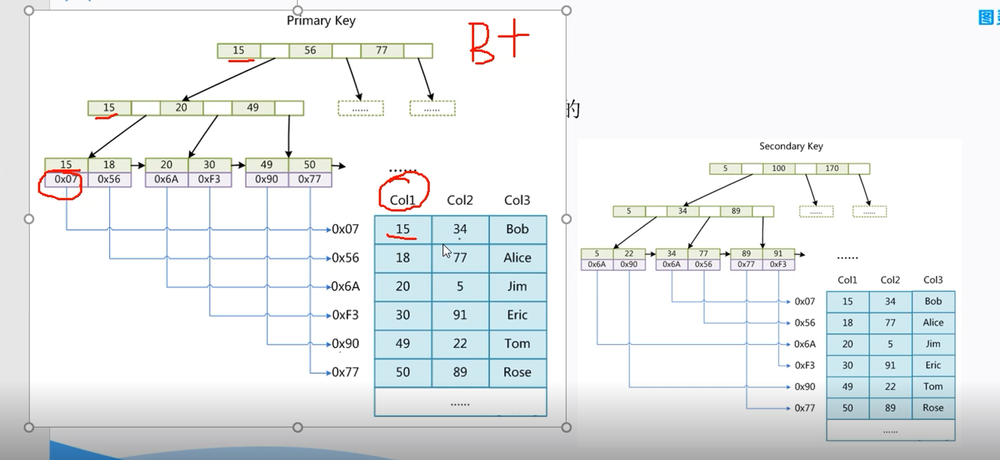  
基于主键的查找：先通过索引找到文件指针，再通过指针去数据文件对应位置查找数据  
普通索引查找与通过主键的查找是相同的。都是叶子节点存储的指针。  
总结： 对于Myiasm, 主键索引和普通索引查找数据没太大区别

### innoDb索引实现 （聚集）
聚集索引是指数据与索引放在一起，innoDb存储引擎的主键索引就是聚集索引。
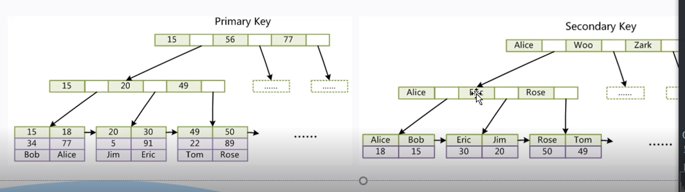  
对于主键索引，叶子节点存储的是完整数据（与myisam存储指针不同）  
对于非主键索引，叶子节点存储的是主键索引的值，利用非主键索引时，会先查到到主键索引值，然后再去主键索引中二次索引，最终查找到数据值  


Qus: 
1. 为什么innodb必须有主键，且推荐使用整型的自增主键？
innoDB的数据文件是按主键进行组织的，如果不建主键，innoDB会自动选一列合适的作为主键或自动生成主键；  

uuid比自增整型浪费空间。索引查找过程中数值的比较优于字符串比较。B+树叶子节点是根据主键索引从左到右自增的。

2. 为什么非主键索引的叶子节点存储的是主键索引的值？  
一致性和存储空间


### 索引最左前缀原理  
联合索引
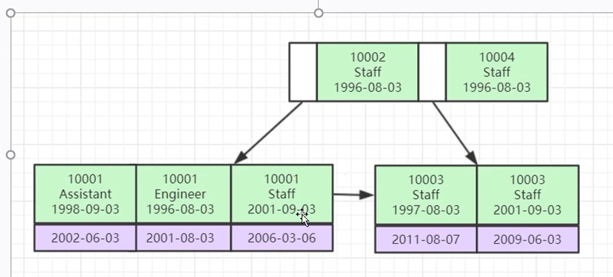  


# <span id="chapter2">二、索引优化</span>  
explain  
`
explain select (select 1 from actor limit 1) from film
`
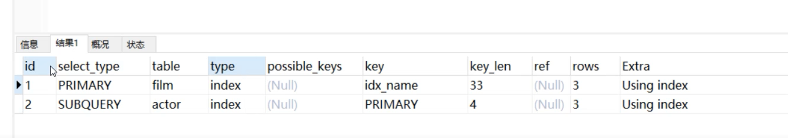  
id： 标识select 语句，select 的序列号，有多少select 就有多少个id, id 越大的
执行优先级越高，相同id的从上往下执行。

select_type：语句对应的类型，
- 包括简单查询simple
- 复杂查询 primary:  复杂查询中最外层的select
- 子查询 subquery： 包含在select 中的子查询，不在from中
- 衍生类型 derived: 复杂查询中包含在from子句中的查询，查询结果放在临时表，也称派生表
- union: 在union中的第二个和随后的select
- union result: 从union临时表检索结果的select

table: 每个select正在访问的表  
具体表名，或者from子查询时为derivedN派生表，或者unions时为union<M,N>, M,N标识参与union的select的id

type: 关联类型或者访问类型，Mysql 决定如何查找表中的行，查找数据记录的大概范围  
从优到差： system > const > eq_ref > ref > range > index > all
- system: 查询的表中只有一行记录，system 是const的特例
- const: 查询结果只有一条数据时（例如用唯一索引或主键索引查询时）
- eq-ref: 关联查询时，被关联的表B每次关联时只能关联到一条记录(唯一值关联)。 A left join B on A.fk = B.pk(B.unique_key)
- ref: 相比eq_ref, 关联是使用的是B表的普通索引（非主键或唯一），关联时可以关联出多条记录。1对多关联
- range: 范围索引通常出现在in between, > < >= <=时，使用索引检索给定范围的行
- index: 扫描全表索引，通常会比All 快一点, 只在索引中查数据（index是从索引读取的，All从硬盘读取）  
  ` select id from film(id是索引列)`
- All: 全表扫描，会去硬盘中查数据，这种情况通常需要增加索引了  
  `select * from film`

possible_keys: mysql 分析出来可能用到的索引（可能有分析时没有分析到，possile_key为null,但是实际执行时又有用到的索引。）

key: 实际执行时，实际用到的索引（例如分析时有可能的索引，但是实际执行，比如数据少时，可能实际执行时没有用到索引）
查询时

key-length: 例如一个索引为int类型（ 4个字节），例如一个四字段的联合索引用到最左两个索引时，key-length就是8（也就可以知道用到的联合索引长度）
注意，不同类型索引的长度不一致，例如datetime 8字节

ref: 联合索引用到的索引字段引用的另一个表的哪个字段
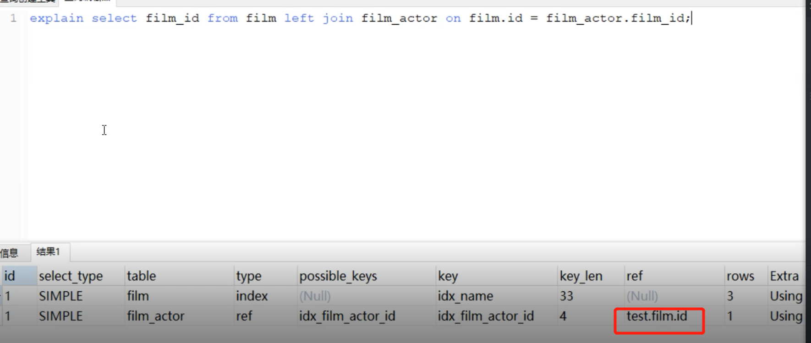 
rows： mysql估计需要扫描的行数，不一定是实际结果的长度

extra: 
- using index: 查询的列被索引覆盖，**且where筛选条件是索引的前导列**（联合索引时，按联合索引的顺序出现在where字段中）， 简称覆盖所有（从内存中的索引就可以查出需要的列，无需硬盘查叶子节点数据）；  
  例如联合索引A,B  select A,B from t where A = 'xxx'  
  是性能高的表现  

- using where, using index: 查询的列被索引覆盖，但是where筛选条件是索引列之一，但**不是索引的前导列**（说明联合索引用得不够好）  
  例如联合索引A,B  select A,B from t where B = 'xxx'  
  出现此情况时，应该考虑如何优化成using index.(调整where 列字段顺序)  
 
- using where: 查询的索引列未被索引覆盖，where筛选条件非索引的前导列
    例如联合索引A,B  select * from t where B = 'xxx'  

- NULL: 查询的列未被索引覆盖，并且where筛选条件是索引的前导列，意味着用到了索引 
(前四种就是组合条件： 是否用到覆盖索引，是否where 的索引是索引的前导列)  
  
- using index condition: 与Using where类似，查询的列不完全被索引覆盖，where条件中是一个前导列的范围；

- using tempory: 从临时表  
    例如子查询， distinct, group by
    如何优化using temprory, 进行消除
    select dinctint name from film;  当对name 建立索引，使其可以通过覆盖索引，直接可以从索引中获取时，就可以不需要建临时表

- using sort: 会对结果使用一个外部索引排序，而不是直接按索引顺序从表里读取行。
     select * from actor order by name; 当name未建立索引时，会用到using sort; 当对name字段建立索引时，就可以变成using index;
    （用到索引时，叶子节点数据从左到右是按索引有序的）

如何查看mysql 语句的查询计划：
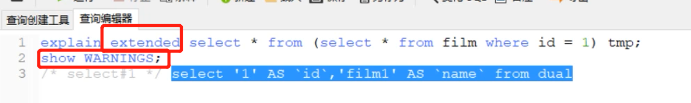  


索引最佳实践
1. 联合索引全值匹配（尽量把联合索引的字段用全）
2. 最佳左前缀原则（把联合索引按顺序使用）
  
联合索引会按顺序进行比较，不按顺序不会用到索引
3. 不要在索引上做任何操作（计算，函数，（自动或手段）类型转换），会导致索引失效
4. 存储引擎不能使用索引中范围条件右边的列  
  EXPLAIN SELECT * FROM employees WHERE name= 'LiLei' AND age = 22 AND position ='manager';  
  EXPLAIN SELECT * FROM employees WHERE name= 'LiLei' AND age > 22 AND position ='manager';  
5. 尽量使用覆盖索引（只访问索引的查询（索引列包含查询列）），减少select *语句
6. mysql使用不等于（!=  <> , 注意，大于小于是可以走索引的）会索引失效，导致全表扫描
7. is null, is not null 无法使用索引
8. like 以通配符开头查询 ‘%aaa’会索引失效 
9. 字符串不加单引号索引失效  
  select * from user where name = '1000';    
  select * from user where name = 1000;  
10. 少用or,用它连接时很多情况下索引会失效  

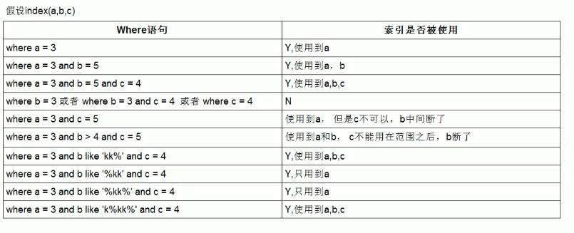  


in和exsits优化
原则：小表驱动大表，即小的数据集驱动大的数据集  
B 表数据更少时：  
select * from A where id in (select id from B)


A表数据更少时：  
select * from A where exists (select 1 from B where B.id = A.id)
将主查询A的数据，放到子查询B中做条件验证，根据验证结果（true或false）来决定主查询的数据是否保留  
EXISTS子查询往往也可以用JOIN来代替（数据少的应该在join前面还是后面？）

总结： 数据少的表要么在in里面，要么在exists前面


## Mysql 锁与事务隔离级别
锁是计算机协调多线程或进程并发访问共享资源的一种机制。

锁的分类：  
- 按性能分：悲观锁和乐观锁（按版本对比 MVCC）  

  乐观锁： 比如多个线程去更新同一个字段，通过版本机制控制一个线程执行成功。  
   update table set field1 = value1 , version = version + 1 where version = 2;  
   悲观锁：会阻塞等待，乐观锁不会等待。 

- 按对数据库的操作分：读锁和写锁（都是悲观锁）    
  
  读锁： 共享锁，多个读操作可以同时进行而不会互相影响。  
  写锁（排他锁）：当前写操作若没有完成，会阻塞其他写锁和读锁。  
  
- 按锁的粒度分： 表锁和行锁

### 表锁（偏读）  
  表锁偏向MyISAM存储引擎，开销小，加锁快，无死锁，锁定粒度大，发生锁冲突的概率最高，并发度最低。
``` mysql
create table `lock`
(
	id int not null,
	name varchar(20) null,
	constraint lock_pk
		primary key (id)
);

INSERT INTO `test`.`mylock` (`id`, `name`) VALUES (1, 'zhangsan')；
INSERT INTO `test`.`mylock` (`id`, `name`) VALUES (2, 'lisi');
INSERT INTO `test`.`mylock` (`id`, `name`) VALUES (3, 'wangwu');
```
- 手动增加表锁  
```
lock table 表名（read）write, 表名2 read(write);
```
- 查看表上加的锁  
```
show open tables;
```
- 删除表锁  
```
unlock tables;
```

- 案例分析（加读锁）
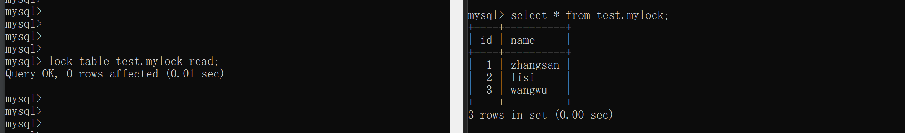  
可见session1对mylock加读锁时，session2仍可以正常的进行读操作。
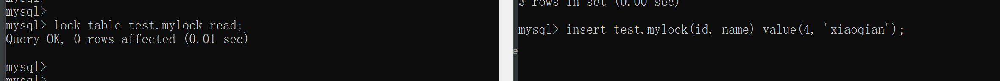
可见session1对mylock加读锁时，其它session进行插入或更新时会等待。
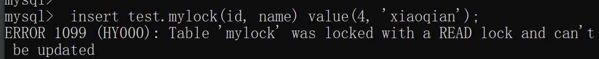
可见session1对mylock加读锁时，当前session继续进行插入或更新时会报错。

- 案例分析（加写锁）
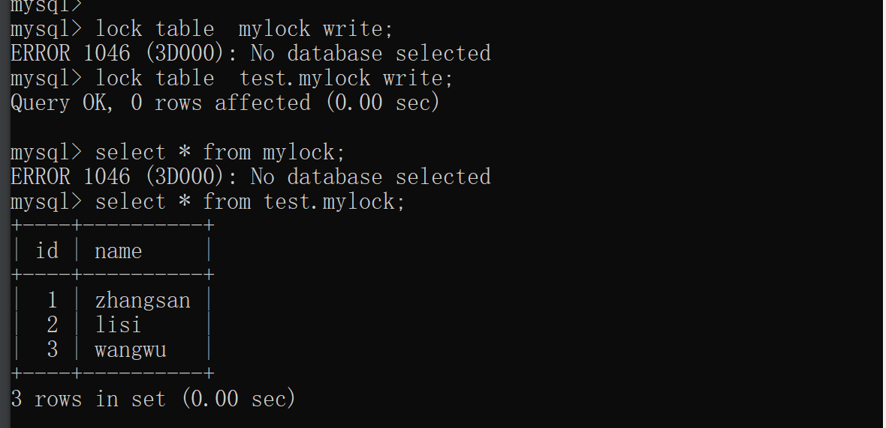
可见session1对mylock加写锁时，当前session继续进行查询或者更新插入时可以正常运行。

可见session1对mylock加写锁时，其他session继续进行查询更新插入时会等待，当session1 释放锁时，其他session就可以继续运行。

【总之】读锁会阻塞写，但是不会阻塞读。而写锁会把其他session读和写都阻塞。
  
### 行锁（偏写）
行锁偏向InnoDB存储引擎，开销大，加锁慢，会出现死锁，锁定粒度最小，发生锁冲突的概率最低，并发度也最高。
InnoDB与MYISAM最大不同有两点：一是支持事务，而是采用了行级锁。  

- 行锁支持事务  

  行锁演示：
 ``` mysql
    CREATE TABLE `account` (
      `id` int(11) NOT NULL AUTO_INCREMENT,
      `name` varchar(255) DEFAULT NULL,
      `balance` int(11) DEFAULT NULL,
      PRIMARY KEY (`id`)
    ) ENGINE=InnoDB DEFAULT CHARSET=utf8;
    INSERT INTO `test`.`account` (`name`, `balance`) VALUES ('lilei', '450');
    INSERT INTO `test`.`account` (`name`, `balance`) VALUES ('hanmei', '16000');
    INSERT INTO `test`.`account` (`name`, `balance`) VALUES ('lucy', '2400');
```
  
  两个session 更新同一条数据。（由于mysql会自动提交并关闭事务，所以如果两个session都是一条update, 第一个session执行结束锁释放了，无法演示行锁。因此需要手动的开启关闭事务来进行演示）
  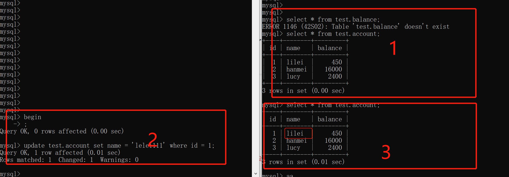
  两个session, 其中一个在事务中，未提交时，其他session是读取不到其修改的。只有当第一个session 执行commit时，会话1的改动才能被其他会话感知到。
  
  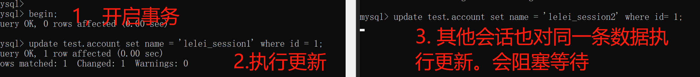
  两个session,其中一个事务在修改某一条数据后，在事务提交前，其他session若修改同一条数据，会阻塞等待。（被加了行锁）。
  当session1 commit提交释放锁的时候，若session2还没有超时，session2的sql会立马执行。最后查询数据库结果，会是后者，也就是session2的结果。
  
  若在第二个session中更新其他行，是可以正常操作的。
  
  示例可以看出，行锁会有等待，所以行锁是悲观锁。
  
  
  
- 事务及其ACID属性  
事务是由一组SQL组成的逻辑处理单元，事务具有以下4个属性
- 原子性： 事务是一个原子操作单元，其对数据的修改，要么全部执行，要么全部都不执行。  
- 一致性： 在事务开始和结束时，数据都必须保持一致状态。  
- 隔离性： 保证事务在不受外部并发操作影响的“独立”环境执行。意味着事务处理过程中的中间状态对外部都是不可见的。  
- 持久性： 事务完成之后,它对于数据的修改是永久性的,即使出现系统故障也能够保持。

## 并发事务处理带来的问题
- 更新丢失  
多个事务选择同一行，基于最初选定值更新该行，由于每个事务都不知道其他事务的存在，就会发生丢失更新问题，最后的更新覆盖了其他事务所作的更新。 
（事务A覆盖了事务B的修改）

- 脏读  
事务A读取到了事务B已经修改但是还没有提交的数据，然后还在此数据基础上进行操作，随后事务B回退了。事务A就读取到了脏数据。  
（未提交的数据就是脏数据）

- 不可重复读 
一个事务在读取某些数据后的某个时间，再次读取以前读过的数据，却发现读出的数据发生了改变或者被删除了。
（事务A读取到了事务B已提交的修改数据。不符合隔离性。）

- 幻读  
一个事务按相同的查询条件，重新检索以前检索过的数据。却发现事务中多读取到了几条数据。
（事务A读取到了事务B已提交的新增数据）

## 事务隔离级别
数据库通过引入事务隔离级别，来解决以上的并发事务处理带来的问题。
脏读，不可重复读， 幻读，都是数据库读一致性问题。必须由数据库提供一定的事务隔离机制来解决。

隔离级别       脏读      不可重复读      幻读
读未提交       可能        可能         可能
读已提交      不可能       可能         可能
可重复读      不可能      不可能        可能
可串行化      不可能      不可能        不可能


查看数据库当前隔离级别  
(mysql 默认隔离级别是REPEATABLE-READ可重复读。)

```mysql
show variables like 'tx_isolation';            -- mysql 8 以前
show variables like 'transaction_isolation';   -- mysql 8

select @@tx_isolation;                         -- mysql 8 以前
select @@transaction_isolation;                -- mysql 8

-- 修改当前会话的隔离级别
set session transaction isolation level read committed;
-- 修改全局的隔离级别
set global transaction isolation level read committed;
```
下面设置成读未提交来演示脏读（事务A执行过程中读取到了事务B未提交的数据）。
  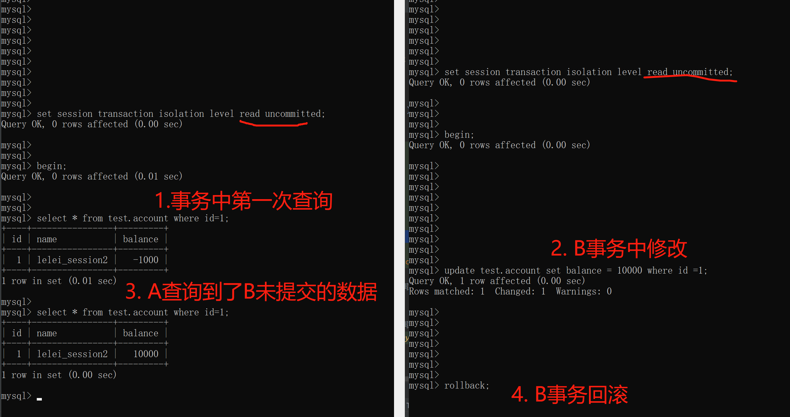

下面设置成读已提交来演示不会出现脏读。
  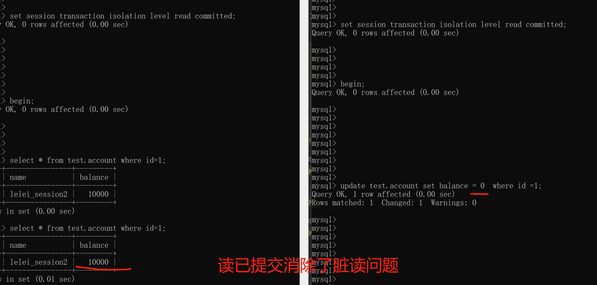

但是读已提交没有解决幻读（事务A执行过程中读取到了事务B已提交的新增数据）。
  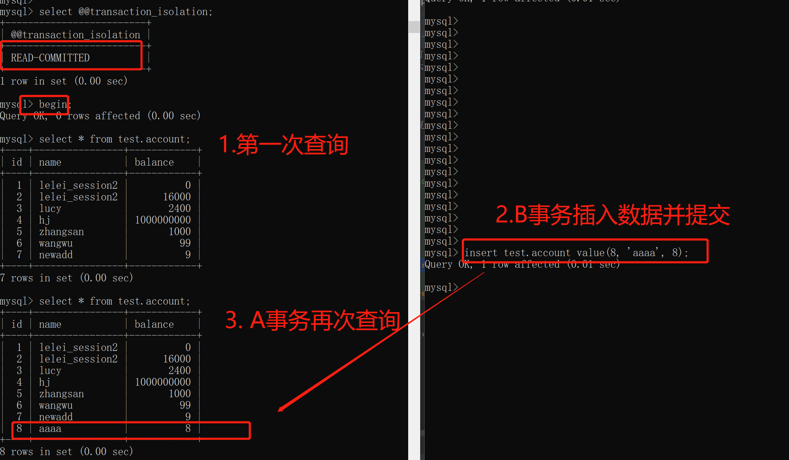
  
读已提交也没有解决不可重复读的问题
  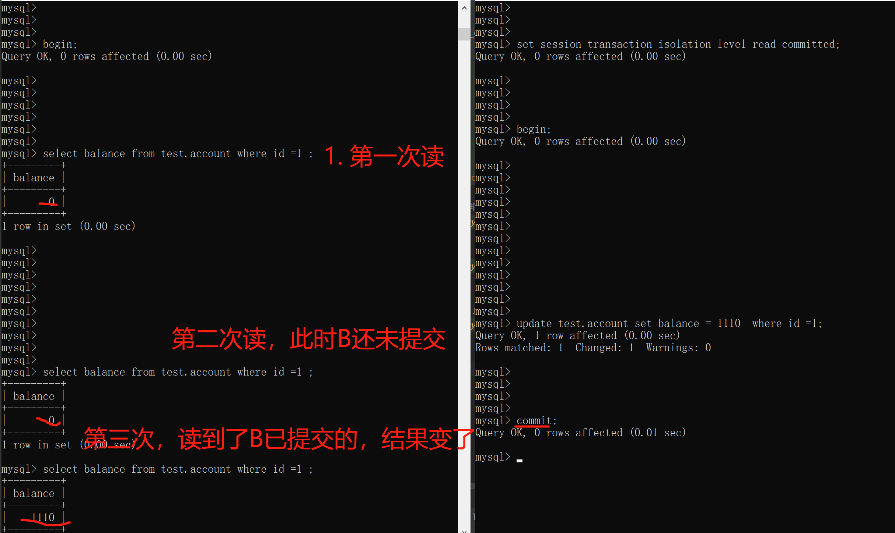

继续修改为可重复读，也就是mysql 默认隔离级别。
  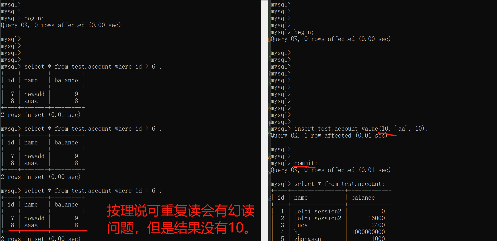
   按理可重复读隔离级别时，其他事务进行插入数据并提交后，当前事务查询会出现幻读，但结果并没有。
  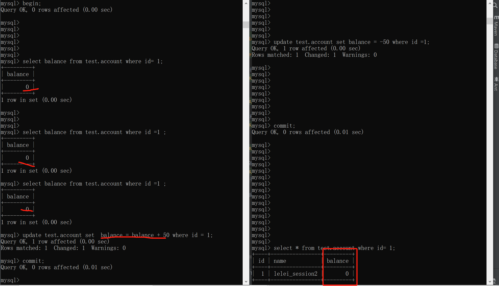
   当可重复读情况下，其余事务对数据修改并提交，当前事务多次select 结果相同，也就是可重复读，但是执行update后，数据并不是事务A查询出的值+50 ，
   而是被B事务提交后的数据库的实际值-50 + 50. 
   原因是： 可重复读的隔离级别下，使用了MVCC（多版本并发控制），select 操作不会更新版本号，是快照版本（历史版本），
   insert, update 和delete 会更新版本号，是当前读（当前版本）。
   
   A 事务多次查询， B事务新增数据并提交，A再次查询结果一致，没有出现幻读。
   但是，如果A事务若此时对B事务刚刚插入的那条数据执行update操作后，再次查询，会查询到B事务已提交的数据。
   （如果更新的不是事务B刚刚插入的数据，而是之前已经可以查到的数据，更新后再次查询，仍然查不到B已提交的新增数据）
     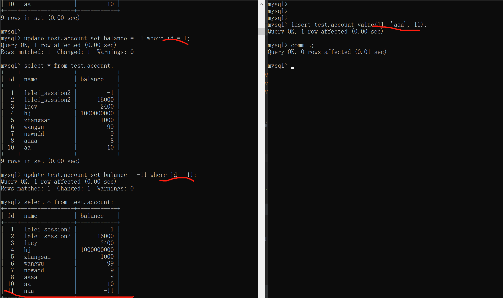
   
   可串行化可解决上述问题，但是效率相对更低。 分布式场景下加锁，也是一定程度上的使之变成可串行化。
   
## 传播机制
