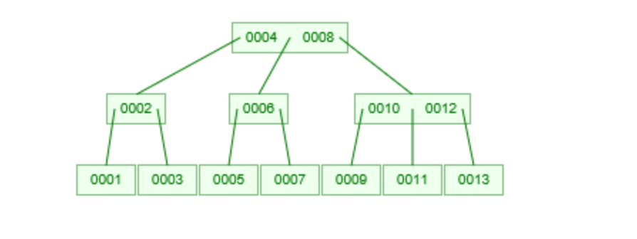

#一、索引原理
帮助Mysql高效获取数据的排好序的数据结构([数据结构教学网站](https://www.cs.usfca.edu/~galles/visualization/Algorithms.html))   
存储在文件里  
索引结构（二叉树，红黑树，Hash, **_Btree_**）

为什么用Btree作为索引，而不是二叉树，红黑树等 ？ 
- 二叉树作为索引

  &emsp;但是当数据升序或者降序时，二叉树就退化成了链表,树深度高 
- 红黑树  
   
  &emsp;红黑树是一个二叉平衡树，自动平衡功能相对二叉树单边增长的情况会更好  
  &emsp;但是红黑树是一种二叉树，当数据量大的时候，树的深度很高，当要查的数据在叶子节点时，会需要很多次磁盘IO操作,查找速度不够快
- Hash  
  &emsp;查询速率快  
  &emsp;等值查询快，但是范围查询：例如>6
  
- Btree  
   
  &emsp; 通过增加树的度数，横向扩展，降低树的高度。几百万的数据甚至可以控制到3-5层。  
  叶节点具有相同的深度  
  叶节点的指针为空  
  叶节点的数据从左向右自增  
  
   &emsp;通过几次找到节点，整个节点数据载入内存，再在内存中进行随机访问找到数据。速度非常快。  
  
   &emsp;是不是度数越大，让树的深度为1的时候最好呢？？
  
- B+Tree  

Mysql中建索引时，可以选择索引类型是Hash或者Btree(一般Hash使用较少)
磁盘数据存储以页为单位，磁盘与内存的交互也是以页为单位。  
-》 B+Tree的节点大小不能过大，需要最好能一次IO就读入内存
-》因此B+Tree的度不能无限的大
mysql 一般会把一个索引节点的大小设置为1页，例如16K

当非叶子节点只存索引，不存数据时，在每个索引节点大小限定（例如1页）的情况下，每个小索引节点占用的大小越小，小索引节点
的数量更多，树的度也就更多，树高度更小，查询时IO次数更少。

叶子节点作为最后一层节点，存储数据不影响IO次数。（叶子层节点中还有从左向右的指针）  
   
非叶子节点的索引做了冗余（如图中15），非叶子节点的数据移到了叶子节点  

B+ tree的度一般会超过100，高度3-5.  

# 二、基于原理分析存储引擎  
说明：存储引擎是在表级别的（建表时可以指定），不是数据库级别
### MYISAM 索引实现
底层数据与索引分开存储（非聚集）
  
基于主键的查找：先通过索引找到文件指针，再通过指针去数据文件对应位置查找数据  
普通索引查找与通过主键的查找是相同的。都是叶子节点存储的指针。  
总结： 对于Myiasm, 主键索引和普通索引查找数据没太大区别

### innoDb索引实现 （聚集）
聚集索引是指数据与索引放在一起，innoDb存储引擎的主键索引就是聚集索引。
  
对于主键索引，叶子节点存储的是完整数据（与myisam存储指针不同）  
对于非主键索引，叶子节点存储的是主键索引的值，利用非主键索引时，会先查到到主键索引值，然后再去主键索引中二次索引，最终查找到数据值  

Qus: 
1. 为什么innodb必须有主键，且推荐使用整型的自增主键？
innoDB的数据文件是按主键进行组织的，如果不建主键，innoDB会自动选一列合适的作为主键或自动生成主键；  

uuid比自增整型浪费空间。索引查找过程中数值的比较优于字符串比较。B+树叶子节点是根据主键索引从左到右自增的。

2. 为什么非主键索引的叶子节点存储的是主键索引的值？  
一致性和存储空间

### 索引最左前缀原理  
联合索引
  

### mysql 调优
explain  
`
explain select (select 1 from actor limit 1) from film
`
  
id： 标识select 语句，select 的序列号，有多少select 就有多少个id, id 越大的
执行优先级越高，相同id的从上往下执行。

select_type：语句对应的类型，
- 包括简单查询simple
- 复杂查询 primary:  复杂查询中最外层的select
- 子查询 subquery： 包含在select 中的子查询，不在from中
- 衍生类型 derived: 复杂查询中包含在from子句中的查询，查询结果放在临时表，也称派生表
- union: 在union中的第二个和随后的select
- union result: 从union临时表检索结果的select

table: 每个select正在访问的表  
具体表名，或者from子查询时为derivedN派生表，或者unions时为union<M,N>, M,N标识参与union的select的id

type: 关联类型或者访问类型，Mysql 决定如何查找表中的行，查找数据记录的大概范围  
从优到差： system > const > eq_ref > ref > range > index > all
- system: 查询的表中只有一行记录，system 是const的特例
- const: 查询结果只有一条数据时（例如用唯一索引或主键索引查询时）
- eq-ref: 关联查询时，被关联的表B每次关联时只能关联到一条记录(唯一值关联)。 A left join B on A.fk = B.pk(B.unique_key)
- ref: 相比eq_ref, 关联是使用的是B表的普通索引（非主键或唯一），关联时可以关联出多条记录。1对多关联
- range: 范围索引通常出现在in between, > < >= <=时，使用索引检索给定范围的行
- index: 扫描全表索引，通常会比All 快一点, 只在索引中查数据（index是从索引读取的，All从硬盘读取）  
  ` select id from film(id是索引列)`
- All: 全表扫描，会去硬盘中查数据，这种情况通常需要增加索引了  
  `select * from film`

possible_keys: mysql 分析出来可能用到的索引（可能有分析时没有分析到，possile_key为null,但是实际执行时又有用到的索引。）

key: 实际执行时，实际用到的索引（例如分析时有可能的索引，但是实际执行，比如数据少时，可能实际执行时没有用到索引）
查询时

key-length: 例如一个索引为int类型（ 4个字节），例如一个四字段的联合索引用到最左两个索引时，key-length就是8（也就可以知道用到的联合索引长度）
注意，不同类型索引的长度不一致，例如datetime 8字节

ref: 联合索引用到的索引字段引用的另一个表的哪个字段
 
rows： mysql估计需要扫描的行数，不一定是实际结果的长度

extra: 
- using index: 查询的列被索引覆盖，**且where筛选条件是索引的前导列**（联合索引时，按联合索引的顺序出现在where字段中）， 简称覆盖所有（从内存中的索引就可以查出需要的列，无需硬盘查叶子节点数据）；  
  例如联合索引A,B  select A,B from t where A = 'xxx'  
  是性能高的表现  
- using where, using index: 查询的列被索引覆盖，但是where筛选条件是索引列之一，但是不是索引的前导列（说明联合索引用得不够好）  
  例如联合索引A,B  select A,B from t where B = 'xxx'  
  出现此情况时，应该考虑如何优化成using index.(调整where 列字段顺序)  
  
  
如何查看mysql 语句的查询计划：
  
