1. 前置脚本，建立表格，并创建联合索引

``` mysql
use test;  
 drop table if exists test;  
 create table test  
 (  
     id int primary key auto_increment,  
     c1 varchar(10),  
     c2 varchar(10),  
     c3 varchar(10),  
     c4 varchar(10),  
     c5 varchar(10)  
 ) ENGINE = INNODB  
   default CHARSET = utf8;  
 
 insert into test(c1, c2, c3, c4, c5)
 values ('a1', 'a2', 'a3', 'a4', 'a5');  
 insert into test(c1, c2, c3, c4, c5)
 values ('b1', 'b2', 'b3', 'b4', 'b5');  
 insert into test(c1, c2, c3, c4, c5)
 values ('c1', 'c2', 'c3', 'c4', 'c5');  
 insert into test(c1, c2, c3, c4, c5)
 values ('d1', 'd2', 'd3', 'd4', 'd5');  
 insert into test(c1, c2, c3, c4, c5)
 values ('e1', 'e2', 'e3', 'e4', 'e5');  
 
 create index idx_test_c1234 on test(c1,c2,c3,c4);
 show index from  test;
```
 2 测试联合索引
 - case 1(最左前缀)
 ``` mysql
explain select * from test where c1='a1' and c2= 'a2' and c3='a3' and c4='a4';
explain select * from test where c1='a1' and c2= 'a3' and c3='a2' and c4='a4';
explain select * from test where c1='a1' and c4= 'a2' and c3='a3' and c2='a4';
explain select * from test where c4='a1' and c3= 'a2' and c2='a3' and c1='a4';
```
正常分析可能会觉得第四条不会用到索引，前几条会全部或部分用到索引。但其实结果是全部用到了四个字段的索引：  
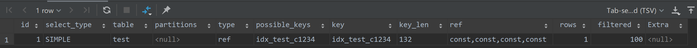  
虽然顺序不是按照索引顺序，但是mysql底层执行计划做了优化。在执行常量等值查询时，改变索引列的顺序并不会更改；  
总结：还是尽量不要打乱联合索引的顺序；

- case2（索引长度）
```mysql
explain select * from test where c4='a1' and c3= 'a2' and c2>'a3' and c1='a4';
explain select * from test where c1='a1' and c2= 'a3' and c3>'a2' and c4='a4';
explain select * from test where c1>'a3' and c2= 'a3' and c3='a2' and c4='a4';
```
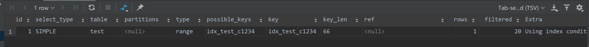  
结果是3个都用到了索引，只是索引长度不一样，分别是 66 99 33 ，也就是分别用到了2个，3个，1个字段索引；（说明，基于mysql8, 有的版本第三条不会用到索引  
总结： 范围右边索引列失效，但是范围当前位置的索引是有效的
- case 3(fileSort)
```mysql
explain select * from test where c1='a3' and c2= 'a3' and c4='a2' order by c3;
```
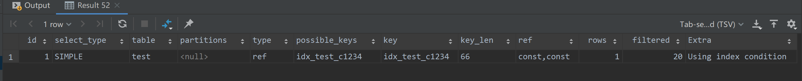  
从key_len 66来看，索引用到了C1,C2两个字段,索引列中间断了C3，所以C4没用到索引，C3只用于了排序   
- case 3.1
```mysql
explain select * from test where c1='a3' and c2= 'a3' and c4='a2' order by c5;
```
排序字段不是索引时，会出现文件排序，using filesort; 只要排序用到了索引字段，就可以去掉fileSort
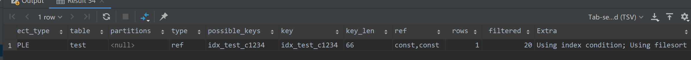  
- case 3.2
```mysql
explain select * from test where c1='a3' and c2= 'a3' order by c3;
explain select * from test where c1='a3' and c2= 'a3' order by c1;
explain select * from test where c1='a3' and c2= 'a3' order by c2;

explain select * from test where c1='a3' and c2= 'a3' order by c4;
```
前三条和3-1结果一致，第四条因为c4 和C1 C2 断层，排序会导致用到fileSort
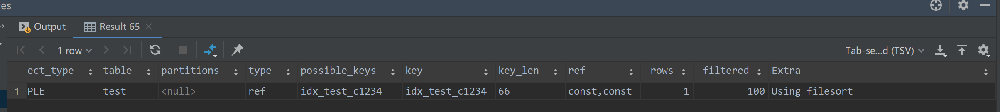  
- case 3.3
```mysql
explain select * from test where c1='a3' and c5= 'a3' order by c2; -- 不会用到filesort
explain select * from test where c1='a3' and c5= 'a3' order by c3; -- 会用到filesort
explain select * from test where c1='a3' and c5= 'a3' order by c4; -- 会用到filesort
explain select * from test where c1='a3' and c5= 'a3' order by c2,c3; -- 不会用到filesort
explain select * from test where c1='a3' and c5= 'a3' order by c3,c2; -- 会用到filesort
explain select * from test where c2= 'a3' order by c2,c3; -- 会用到filesort

```
当order by 可以用到索引就不会出现fileSort；  
 c3 c2 交换顺序后，无法用到联合索引 c1, c2, c3进行排序
去掉c1列查找后，c2, c3 也无法用到索引
- case 3.4

但是, 对比3.3的第五条：
```mysql
explain select * from test where c1='a3' and c2= 'a3' order by c3,c2; 
```
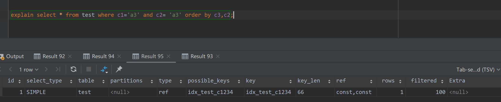  
会发现C3,C2顺序反了，却没有用到fileSort. 这是因为where中C2是常量，所以这个语句需要排序的也只有C3, C1,C2,C3是连续的，因此不会用到fileSort；

- case 3.5
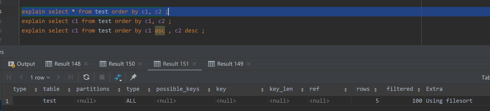  

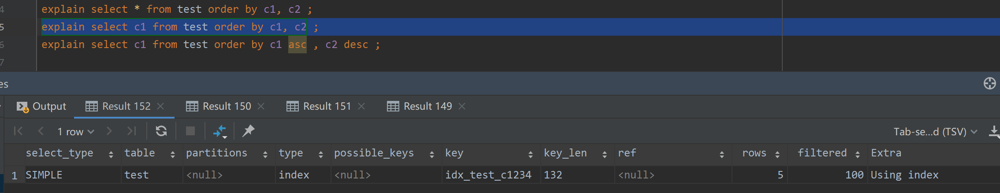  

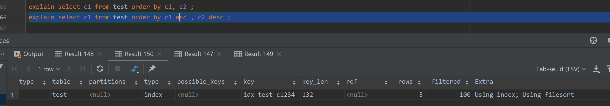  


- case 4（using temporary）
- case 4.1
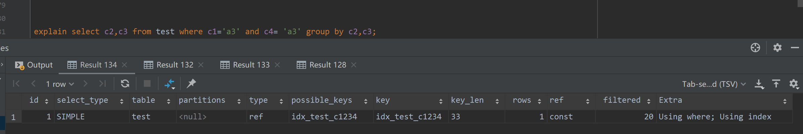   

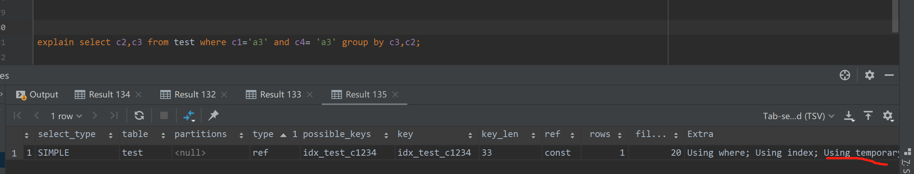  
group by 顺序反了之后，会出现using temporary;


- case 5 ( using index;using where;using index,using where; using index condition)
查询列被索引覆盖using index:
```mysql
explain select c1 from test ;                
explain select c1 from test where c1='c1';
explain select c1 from test where c1='c1' and c2 = 'c2';
```

查询的索引列未被索引覆盖，where筛选条件非索引的前导列: using where
```mysql
explain select c5 from test where c2 = 'c1' ;
explain select c5 from test where c3 = 'c1' ;
explain select c5 from test where c2 = 'c1' and c3='c3';
```

查询的索引列被索引覆盖，where筛选条件非索引的前导列:using index, using where
```mysql
explain select c2 from test where c2 = 'c1' ;
explain select c3 from test where c3 = 'c1' ;
explain select c2 from test where c2 = 'c1' and c3='c3';
```

NULL：查询的列未被索引覆盖，并且where筛选条件是索引的前导列，意味着用到了索引，但是部分字段未被索引覆盖，必须通过“回表”来实现，不是纯粹地用到了索引，也不是完全没用到索引
```mysql
explain select c1,c5 from test where c1='c1' and c2='c2';              -- null
explain select c1,c5 from test where c1='c1' and c2='c2' and c3='c3';  -- null
```

与Using where类似，查询的列不完全被索引覆盖，where条件中是一个前导列的范围: using index condition
```mysql
explain select * from test where c1>'c1';                  -- Using index condition
explain select * from test where c1>'c1' and c2>'c2';      -- Using index condition
explain select * from test where c1='c1' and c2>'c2';      -- Using index condition
explain select c1,c5 from test where c1='c1' and c2>'c2';  -- Using index condition
explain select c1,c5 from test where c1='c1' and c3='c2';  -- Using index condition
explain select c1,c5 from test where c2='c1' and c3='c2';  -- using where
```
