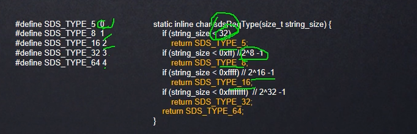
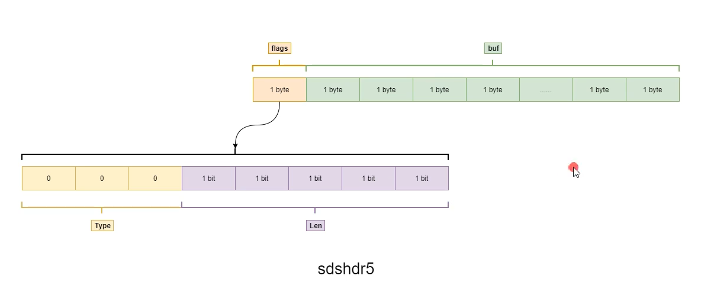
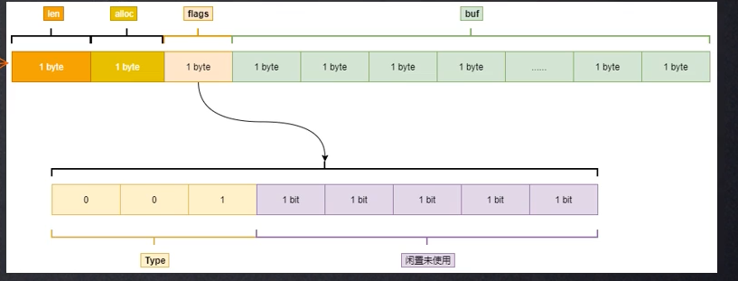

## redis 简介
非关系型的   键值对的数据库。O（1）插入或者去除元素
数据存在内存中的  
键唯一，可以是字符串，整形，浮点型等，key都会按string类型进行存储。  
```redis
   redis 实现语言是c, c语言存储string 用的是char []  data = "hhhh '\0'"
   那redis 为什么不用字符串数组保存string呢。
   
   char []  data = "hhhh '\0'", C语言中以'\0'作为字符串结束，而在分布式存储， key是客户端携带过来的，比如python，php等。
   如果以char[] 存储string 的key, 那么如果字符串中有'\0'，可能会被提前截断，出现数据安全问题。
  -----------
   因此，redis 自定义了一个数据类型： sds : simple dynamic string (简单动态字符串)
   sds:   二进制安全数据结构
   -  len  数据长度
   -  free 剩余空间
   -  char  buf[] （总长度为len + free）
   这样根据len长度进行读取，不会出现数据截断问题。

   同时，c语言定义字符数据需要预定义长度，当需要修改字符串，如果数据变长需要扩容，需要重新分配内存并拷贝。  

   而sds的动态的含义则是： 动态扩容机制：
   sds中有一个free属性：剩余空间大小。
   例如数据长度len 3 -》 4, 当前总长度为3.
   长度不够则扩容，数据总长度 * 2 变成6.  则free 为3， len为3. 修改数据后，free为2
   当free长度再次不够用时，数据会再次扩容 * 2。 
   当大小》1024(1M时)， 不再会成倍扩容，而是每次增加1M。
  
   总结： 动态扩容机制，避免频繁内存分配
```  
值类型可以是string,hash,set,list,sorted set  
内置了复制，磁盘持久化，lua脚本，事务，ssl, 客户端代理等功能  
通过哨兵和自动分区提供高可用性。


## redis 应用场景
- 缓存  
- 计数器  
  进行自增自减运算，适合频繁读写的计数功能
- 分布式id生成  
  利用自增特性，一次请求一个大一点的步长，比如incr 2000,缓存在本地使用，用完再请求
- 海量数据统计  
  bitmap：存储是否参加过某次果冻，日活统计等
- 会话缓存  
  统一存储多台服务器后台服务器的会话信息。当应用服务器不再存储用户会话信息，也就不再具有状态。用户可以任意访问某台服务器，可以更好的伸缩及扩容。
- 分布式队列/阻塞队列  
  list是一个双向链表，可以通过rpush/lpop和 lpop/rpush写入和读取消息。也可以通过brpop/blpop来实现阻塞队列。
- 分布式锁  
  在分布式场景下，进行多实例进程应用之间的同步。setNx
- 热点数据存储
  最新评论，最新文章列表。使用list存储，ltrim取出热点数据，删除老数据
- 社交类需求  
  set 可以实现交集，并集。进行好友，文章推荐等
- 排行榜  
  zset 可以实现有序性操作
- 延迟队列  
  使用sorted_set. 使用当前时间+需要延迟的时间 （也就是过期时间）作为score. 消息元素为内容，zadd 生产消息，zrangeByScore获取当前时间之前的数据做轮询处理，消费完再删除任务 rem key member
  
  
  
## redis 基础数据结构
不同数据结构的key都是字符串类型，只是值的类型不一样。redis 共有5种数据结构： string, list, hash, set, zset。
 

- string  
  value为字符串类型，比如缓存用户信息。将用户信息结构体使用 JSON 序列化成字符串，然后将序列化后的字符串塞进 Redis 来缓存。  
  
  ```redis
  set key value
  get key
  exist key
  del key
  
  mset key1 value1 key2 value2
  mget key1 key2
  
  expire key 5           -- 5秒后过期
  setnx key value        -- 如果键key不存在，则执行
  SETEX key 60 redis     -- 设置值同时设置过期时间60s, 如果key已经存在，值覆盖
  ```
- list  
   Redis 的列表相当于 Java 语言里面的 LinkedList. 插入删除快，查询慢；  
   列表弹出了最后一个元素之后，该数据结构自动被删除；  
   Redis 的列表结构常用来做异步队列使用（一个线程放入消息，另一个取消息）；  
   
   redis 的 list 可以实现队列或栈的数据结构，区别只是先进先出和先进后出。
   
   - 右进左处：队列
   ```redis
   rpush key  v1  v2  v3
   llen key 
   lpop
   ```
  
   - 右进右出： 栈
   ```redis
   rpush key  v1  v2  v3
   llen key 
   rpop
   ```
- hash  
   hash 字典。  
   例如存user 信息可以直接存成hashmap, 相比序列化为字符串存储，取值更方便，不需要全部取出来，进行反序列化为对象，再取对应的信息。  
   存储消耗相对字符串会更高。如果经常会拿某些固定的属性，hash性能更高，如果一般是需要整体信息，用string 会更合适一点。
   ```redis
   hset user1 name aaa
   hset user1 age 23
   hset user1 gender male
   
   hmset user2  name bbb  age 24 gender female 
  
   hgetall user1      -- 获取所有key 和value. 会得到6行数据
   hget user1 name    -- 只获取某个信息
   ```
- set  
  无序集合，相当于 Java 语言里面的 HashSet
     ```redis
     sadd users aaa     -- 添加1个元素，返回1
     sadd users aaa     -- 添加重复元素，返回0
     sadd users bbb ccc -- 添加2个元素，返回2
     sismember users  aaa   -- 判断aaa 是否是集合中元素  是返回1
     scard users        -- 获取长度  返回3
     spop users         -- 弹出一个。无序
     ```
  
- zset  
  有序集合，给每个 value 赋予一个 score，代表这个 value 的排序权重
  应用场景： 比如存学生id和成绩，按分数排序即是排名。
            热搜排行榜  
            
       ```redis
       zadd users  98 aaa     -- 添加1个元素，score为98
       zadd users  60 bbb    
       zcard users            -- 获取长度  返回2
       zscore users  aaa      -- 获取aaa分数
       zrank  users  aaa      -- 获取aaa的排名  返回1
       ```
       
 - 其他高级命令  
   - keys   
   全量遍历键， 列出符合正则的所有键。 （大数据量时不推荐使用，一是性能影响，二是可能超时）  
   ```redis
    keys user*                   -- 查出user开头的所有键
    keys *                       -- 查出所有键
    keys us*r
   ```
   
   - scan  
   在keys 全量匹配的基础上，类似分页查找。实现渐进式遍历key.  
   SCAN cursor [MATCH pattern] [COUNT count]   
   cursor - 游标。  
   pattern - 匹配的模式。   
   count - 指定从数据集里返回多少元素，默认值为 10   
   
   返回结果中第一个值为整数，作为下一次遍历的cursor; 当返回的cursor为0时表示遍历结束（游标是个类似hash值，所以可能分页过程中，下一次的游标值可能更小。
）
   返回结果中第二个值为list, 返回范围内匹配的key值;
   ```redis 
   scan 0 match user* count 1000      -- cursor 0   正则 user*   limit 1000
   ```
    
   测试结果发现4个数据时，limit 若为3，仍然一次返回了全部数据。当limit为2时，就分成了两页。
   
## Redis 存储结构  
   hashtable 结构  
     
   和hashmap 类似，key hash值相同的存在一个链表里，hash冲突时使用头插法，插入到链表头部
   redis的hash也会涉及rehash(扩容时)。  
   
   
## redis 数据结构
- ### String  
  redis 3.2以前：
```
  struct sdshdr {
      int len;             // 4个字节，32位，可表示2的32次方长度的空间
      int free;
      char[] buf;          // n 字符
  }
 
 这种数据结构简单，但是浪费内存，正常情况数据一般比较短，不会需要2的32次方的长度，即不需要32位长度来表示空间大小。
```
  redis 3.2以后：  
  合理优化数据结构大小。用更少的空间去表示数据长度。    
  根据数据长度，结构分为 sdshdr5,sdshdr8,sdshdr16,sdshdr32,sdshdr64。  
  分别使用于字符串长度在2^5以内，2^8次方以内，... 2^64以内的字符串。  
  即：
     
    使用3位type 来标识type, type 0-4 分别对应sdshdr5~sdshdr64.
  
  - sdshdr5
  ```
   struct sdshdr5 {
      unsigned char flags;  // 1字节标识位 （低3位：type    高5位： 字符串长度）
      char buf[];           // n 字符
   }
  ``` 
   
  - sdshdr8
  ```
   struct sdshdr8 {
      uint8_t len;         //8 位去表示已使用空间大小
      uint8_t alloc;       // 分配的总大小  2^8  (即表示长度最多255)
      unsigned char flags; // 1字节标识位 （低3位：type    高5位： 闲置未用）
      char buf[];          // n 字符
   }
  ``` 
   
  sdshdr16 与 sdshdr8类似,其余类似
   ```
     struct sdshdr16 {
        uint16_t len;         //16 位去表示已使用空间大小
        uint16_t alloc;       // 分配的总大小  2^16  (即表示长度最多65535)
        unsigned char flags; // 1字节标识位 （低3位：type    高5位： 闲置未用）
        char buf[];          // n 字符
     }
   ``` 
  
## Redis info 查看redis服务运行信息   
  - Server 服务器信息
  - Clients 
  - Memory
  - Persistence
  - Stats 统计信息
  - Replication
  - CPU
  - Cluster
  - Keyspace
      
   
## Redis 核心原理（单线程 & 高性能） 
   - 单线程却很快？  
   数据都在内存中，内存级别的运算；  
   单线程避免了多线程的切换性能损耗问题；  
   采用了IO多路复用技术。
     
   由于单线程，要谨慎使用Redis的耗时命令（比如keys），防止卡顿(会造成后续等待请求的长时间阻塞等待)。同时key,value的值尽量不要太大，会降低qps。  
   
   - 单线程如何处理那么多的并发连接？  
         
   并发的请求到服务端后会进行排队。  
   
   
## Redis 持久化
  以下几种方式，在配置文件中(redis.conf)可配置。  

- 1、RDB 快照  
  默认情况下，redis采用rdb方式持久化，快照会保存在dump.rdb的二进制文件中。 在指定时间内变更数量达到多少就会触发快照保存  
（但是如果没达到变更数，redis宕机则可能会导致数据丢失）
```redis
  save  seconds changes
  save  900  1            # 15分钟内至少有1个change(数据更新操作)，就保存一次快照
  save  300  10           # 5分钟内至少有10个change(数据更新操作)，就保存一次快照
  save ""                 # 不开启RDB
```   
     

- 2、AOF(append-only file)  
   aof持久化方式默认关闭。
```
       appendonly  no     # 默认关闭aof
```
          
   每当redis执行一个改变数据集的命令时，这个命令会append写入到aof文件中；  
   当redis重启时，会将aof中的命令重新执行。
  可以配置Redis多久将aof中数据fsync到磁盘一次。（大数据情况下，使用AOFredis启动会很慢）   
    ```redis
    appendfsync always      # 每个更新命令追加到aof文件时就执行一次fsync: 数据安全但非常慢
    appendfsync everysec    # （aof默认配置）每秒fsync一次，故障时只会丢失1s的数据
    appendfsync no          # 从不fsync
    ```
   如果AOF和rdb模式都开启，redis重启时只会使用aof中的数据。  
   
- 3、Redis 4.0 后混合模式  
   重启redis时，若使用rdb快照文件进行内存数据恢复，会丢失大量数据。若只使用aof重放日志操作会启动耗时很长。    
   因此，4.0 后结合rdb 和aof。  
   ```redis
   aof-use-rdb-preamble yes  # redis.conf 中开启aof混合模式（要生效的前提还需开启aof）
   ```
   开启redis重启的时候，预加载rdb的内容，再重放增量的aof文件来替待AOF全量重放。  
   （重写这一刻之前的内存rdb快照文件的内容和增量的 AOF修改内存数据的命令日志文件存在一起，都写入新的aof文件。定期根据内存的最新数据生成aof文件）  
   
   - 3.1 混合持久化aof文件结构  
        

  如果一个key连续set很多次，单独只用aof重写的话会执行很多次操作。  
  混合模式下，重写当前时刻之前的aof文件生成RDB快照（命令bgrewriteaof），一个key连续set很多次时，aof文件中只会有一条最新结果的set数据。  
  重写也就实现了aof的文件瘦身。   
   （纯指令的aof文件就变成了二进制的rdb文件 + 剩余的增量aof（重写过程中新执行的命令））
  redis.conf配置中对于重写的配置:  
  ```redis
    auto-aof-rewrite-percentage 100    # aof 文件大小增长100%，也就是翻倍时，重写
    auto-aof-rewrite-min-size 64mb     # aof 重写需要文件最小达到64M
   ```
  混合持久化的好处：  
  - 整合rdb 与aof的优点，数据不易丢失，且redis重启速度更快
  
  [博客：redis 配置文件配置项介绍](https://www.cnblogs.com/lc-chenlong/p/4194150.html)
## redis 实现分布式锁
- incr  
  对某个key执行incr（原子自增操作）, 第一个执行的结果是1， 第二个执行的结果是2.  
  也就是说，可以认为返回1的线程获取到锁。
  
  这个原子计数和JAVA的atomicInterger的原子操作的区别是：  
  java 是通过CAS来实现的原子计数。三个线程都加1结果可能是2（加的结果被覆盖）。  
  但是redis底层是单线程排队，所以原子计数永远不会出现类似3个线程+1，最后结果为2的情况。
  
- setnx  
  setnx key value, 当key 不存在时，值设置成功。
  

- set 
  
## 缓存淘汰策略
 当redis内存超出物理内存限制时，内存数据会和磁盘频繁交换，redis性能急剧下降。生产环境中不应该允许redis
 出现交换行为。  
 redis提供了配置参数maxmemory 限制内存超出期望大小。
 
 内存超出maxmemory时，可选淘汰策略：
 - noeviction: 默认策略，无法继续写入，但可以删除。可以保证不丢数据。但是线上业务不能持续进行。
 - volatile-lru: 淘汰最近最少使用的设置了过期时间的key, 没有设置过期时间的key不会被淘汰。保证需要持久化的数据不会突然丢失。
 - volatile-ttl: 根据key的剩余寿命的ttl的值，ttl越小越优先被淘汰。
 - volatile-random: 淘汰过期key集合中的随机key.
 
 - allkeys-lru: 区别于volatile-lru，allkey-lru会针对所有的key进行淘汰。
 - allkey-random: 全部key中随机淘汰

 
 volatile-xxx 策略只会针对带过期时间的key进行淘汰。allkey-xxx 针对全部key.  
 
 如果只是做缓存，应该使用allkey-xxx. 如果还想使用持久化功能，就使用volatile-xx策略。
 这样可以保留没有设置过期时间的key, 是永久的key,不会被lru淘汰。
