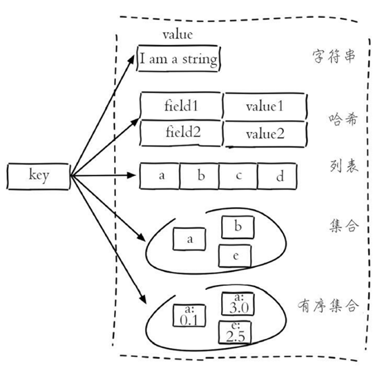
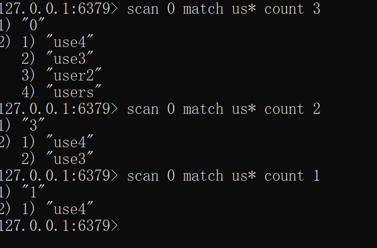
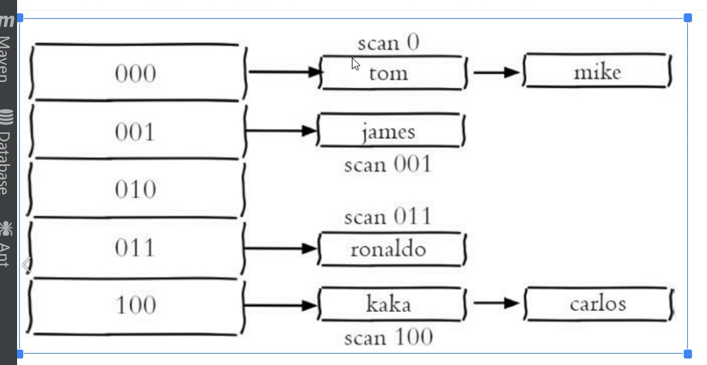
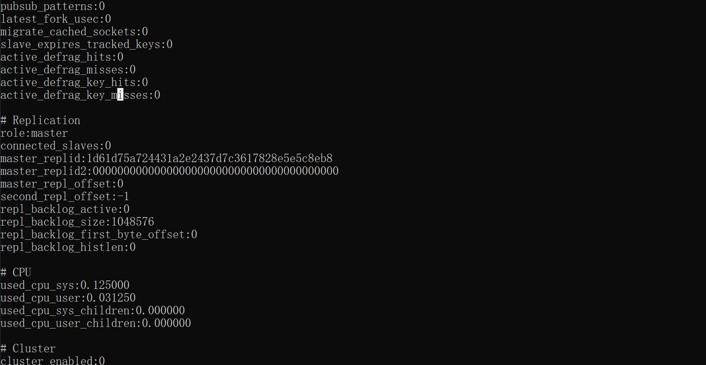
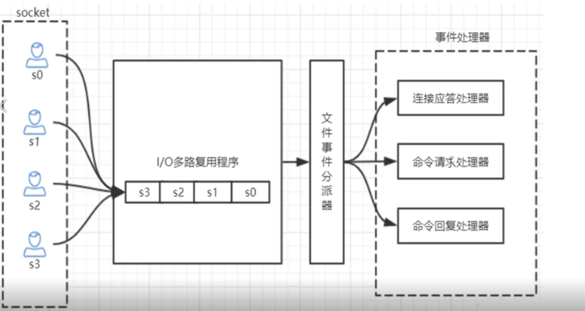
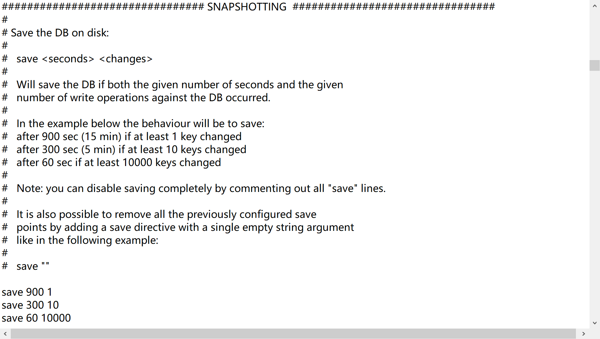
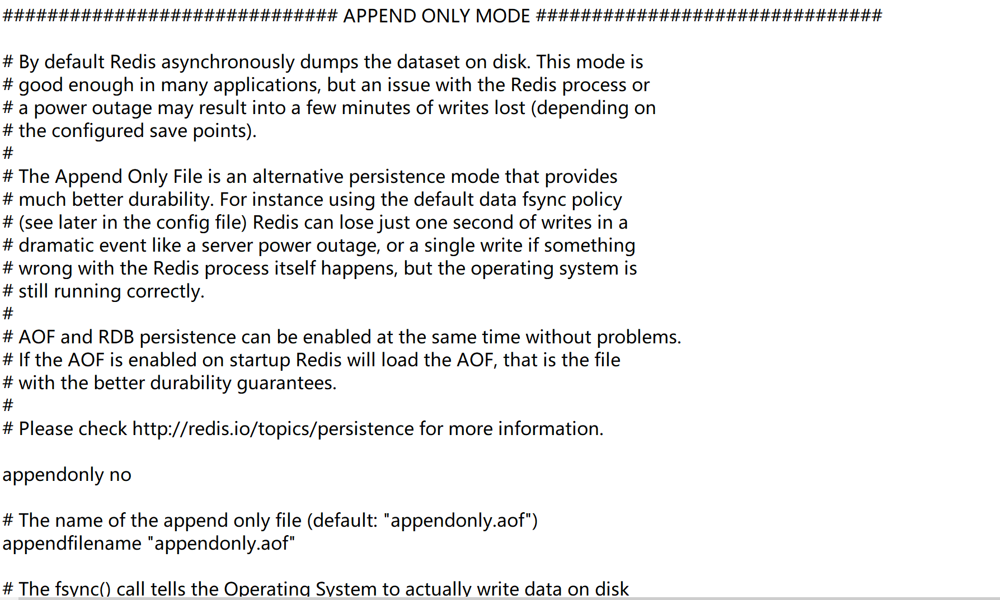
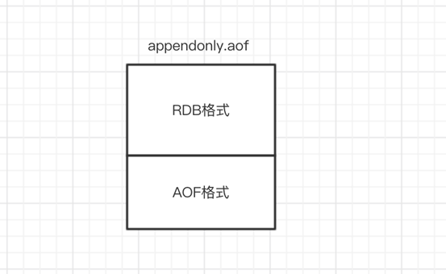

## redis 基础数据结构
不同数据结构的key都是字符串类型，只是值的类型不一样。redis 共有5种数据结构： string, list, hash, set, zset。
 

- string  
  value为字符串类型，比如缓存用户信息。将用户信息结构体使用 JSON 序列化成字符串，然后将序列化后的字符串塞进 Redis 来缓存。  
  
  ```redis
  set key value
  get key
  exist key
  del key
  
  mset key1 value1 key2 value2
  mget key1 key2
  
  expire key 5           -- 5秒后过期
  setnx key value        -- 如果键key不存在，则执行
  SETEX key 60 redis     -- 设置值同时设置过期时间60s, 如果key已经存在，值覆盖
  ```
- list  
   Redis 的列表相当于 Java 语言里面的 LinkedList. 插入删除快，查询慢；  
   列表弹出了最后一个元素之后，该数据结构自动被删除；  
   Redis 的列表结构常用来做异步队列使用（一个线程放入消息，另一个取消息）；  
   
   redis 的 list 可以实现队列或栈的数据结构，区别只是先进先出和先进后出。
   
   - 右进左处：队列
   ```redis
   rpush key  v1  v2  v3
   llen key 
   lpop
   ```
  
   - 右进右出： 栈
   ```redis
   rpush key  v1  v2  v3
   llen key 
   rpop
   ```
- hash  
   hash 字典。  
   例如存user 信息可以直接存成hashmap, 相比序列化为字符串存储，取值更方便，不需要全部取出来，进行反序列化为对象，再取对应的信息。  
   存储消耗相对字符串会更高。如果经常会拿某些固定的属性，hash性能更高，如果一般是需要整体信息，用string 会更合适一点。
   ```redis
   hset user1 name aaa
   hset user1 age 23
   hset user1 gender male
   
   hmset user2  name bbb  age 24 gender female 
  
   hgetall user1      -- 获取所有key 和value. 会得到6行数据
   hget user1 name    -- 只获取某个信息
   ```
- set  
  无序集合
     ```redis
     sadd users aaa     -- 添加1个元素，返回1
     sadd users aaa     -- 添加重复元素，返回0
     sadd users bbb ccc -- 添加2个元素，返回2
     sismember users  aaa   -- 判断aaa 是否是集合中元素  是返回1
     scard users        -- 获取长度  返回3
     spop users         -- 弹出一个。无序
     ```
  
- zset  
  有序集合，给每个 value 赋予一个 score，代表这个 value 的排序权重
  应用场景： 比如存学生id和成绩，按分数排序即是排名。
            热搜排行榜  
            
       ```redis
       zadd users  98 aaa     -- 添加1个元素，score为98
       zadd users  60 bbb    
       zcard users            -- 获取长度  返回2
       zscore users  aaa      -- 获取aaa分数
       zrank  users  aaa      -- 获取aaa的排名  返回1
       ```
       
 - 其他高级命令  
   - keys   
   全量遍历键， 列出符合正则的所有键。 （大数据量时不推荐使用，一是性能影响，二是可能超时）  
   ```redis
    keys user*                   -- 查出user开头的所有键
    keys *                       -- 查出所有键
    keys us*r
   ```
   
   - scan  
   在keys 全量匹配的基础上，类似分页查找。实现渐进式遍历key.  
   SCAN cursor [MATCH pattern] [COUNT count]   
   cursor - 游标。  
   pattern - 匹配的模式。   
   count - 指定从数据集里返回多少元素，默认值为 10   
   
   返回结果中第一个值为整数，作为下一次遍历的cursor; 当返回的cursor为0时表示遍历结束（游标是个类似hash值，所以可能分页过程中，下一次的游标值可能更小。
）
   返回结果中第二个值为list, 返回范围内匹配的key值;
   ```redis 
   scan 0 match user* count 1000      -- cursor 0   正则 user*   limit 1000
   ```
    
   测试结果发现4个数据时，limit 若为3，仍然一次返回了全部数据。当limit为2时，就分成了两页。
   
## Redis 存储结构  
   hashtable 结构  
     
   和hashmap 类似，key hash值相同的存在一个链表里，redis的hash也会涉及rehash(扩容时)。  
   
## Redis info 查看redis服务运行信息   
  - Server 服务器信息
  - Clients 
  - Memory
  - Persistence
  - Stats 统计信息
  - Replication
  - CPU
  - Cluster
  - Keyspace
      
   
## Redis 核心原理（单线程 & 高性能） 
   - 单线程却很快？  
   数据都在内存中，内存级别的运算；  
   单线程避免了多线程的切换性能损耗问题；  
   采用了IO多路复用技术。
     
   由于单线程，要谨慎使用Redis的耗时命令（比如keys），防止卡顿(会造成后续等待请求的长时间阻塞等待)。同时key,value的值尽量不要太大，会降低qps。  
   
   - 单线程如何处理那么多的并发连接？  
         
   并发的请求到服务端后会进行排队。  
   
   
## Redis 持久化
  以下几种方式，在配置文件中(redis.conf)可配置。  

- 1、RDB 快照  
  默认情况下，redis采用rdb方式持久化，快照会保存在dump.rdb的二进制文件中。 在指定时间内变更数量达到多少就会触发快照保存  
（但是如果没达到变更数，redis宕机则可能会导致数据丢失）
```redis
  save  seconds changes
  save  900  1            # 15分钟内至少有1个change(数据更新操作)，就保存一次快照
  save  300  10           # 5分钟内至少有10个change(数据更新操作)，就保存一次快照
```   
     

- 2、AOF(append-only file)  
   aof持久化方式默认关闭。
          
   每当redis执行一个改变数据集的命令时，这个命令会append写入到aof文件中；  
   当redis重启时，会将aof中的命令重新执行。
  可以配置Redis多久将aof中数据fsync到磁盘一次。（大数据情况下，使用AOFredis启动会很慢）   
    ```redis
    appendfsync always      # 每个更新命令追加到aof文件时就执行一次fsync: 数据安全但非常慢
    appendfsync everysec    # （aof默认配置）每秒fsync一次，故障时只会丢失1s的数据
    appendfsync no          # 从不fsync
    ```
   
- 3、Redis 4.0 后混合模式  
   重启redis时，若使用rdb快照文件进行内存数据恢复，会丢失大量数据。若只使用aof重放日志操作会启动耗时很长。    
   因此，4.0 后结合rdb 和aof。
   ```redis
   aof-use-rdb-preamble yes  # redis.conf 中开启
   ```
   开启redis重启的时候，预加载rdb的内容，再重放增量的aof文件来替待AOF全量重放。  
   （重写这一刻之前的内存rdb快照文件的内容和增量的 AOF修改内存数据的命令日志文件存在一起，都写入新的aof文件。定期根据内存的最新数据生成aof文件）  
   
   - 3.1 混合持久化aof文件结构  
        

   
## redis 实现分布式锁
- incr  
  对某个key执行incr（原子自增操作）, 第一个执行的结果是1， 第二个执行的结果是2.  
  也就是说，可以认为返回1的线程获取到锁。
  
  这个原子计数和JAVA的atomicInterger的原子操作的区别是：  
  java 是通过CAS来实现的原子计数。三个线程都加1结果可能是2（加的结果被覆盖）。  
  但是redis底层是单线程排队，所以原子计数永远不会出现类似3个线程+1，最后结果为2的情况。
  
- setnx  
  setnx key value, 当key 不存在时，值设置成功。
  

- set 
  
